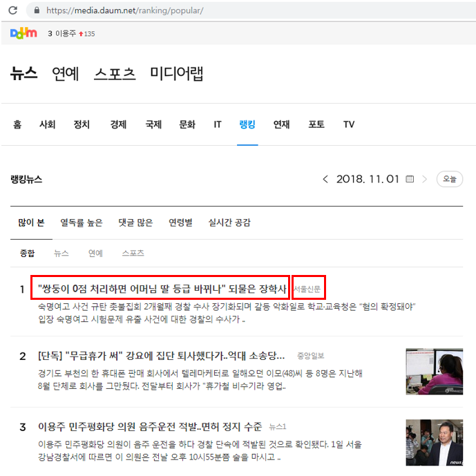

다음에 제시된 웹 페이지는 다음뉴스의 랭킹페이지이다.

(http://media.daum.net/ranking/popular/)

이 페이지에서 각 뉴스의 제목과 이 뉴스를 올린 신문사명칭을 스크래핑(50개)하여

newstitle, newspapername 형식의 데이터프레임을 만들어 

CSV 파일로 저장한다.(daumnews.csv)

 

파일명 : daumnews.R



```R
url <- "https://media.daum.net/ranking/popular/"
text <- read_html(url)
text
nodes<-html_nodes(text,".#mArticle > cont_thumb > strong > a")
newstitle<-html_text(nodes, trim=T)
newstitle<-gsub("\t", "" ,newstitle)
newstitle<-gsub("[\r\n]", "" ,newstitle)
newstitle<-gsub("\n", "" ,newstitle)
nodes<-html_nodes(text,".info_news")
newspapername <-html_text(nodes, trim=T)
newspapername <-gsub("\t", "" ,newspapername)
newspapername <-gsub("[\r\n]", "" ,newspapername)
newspapername <-gsub("\n", "" ,newspapername)
newspage  <- data.frame(newstitle,newspapername)
write.csv(newspage, "daumnews.csv")
```

