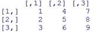
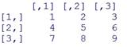
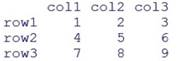
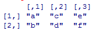

[문제1] 10 에서 38사이의 숫자 중에서 2씩 증가한 값으로 벡터를 생성하고

​      3행 5열의 매트릭스를 만들어 m1 에 저장한다.(행 우선 저장)

​      각 원소 값들에 +100 한 결과로 매트릭스 m2 를 만든다.

​      m1 에서 최대값을 추출하여 m_max_v 에 저장한다.           

​      m1 에서 최소값을 추출하여 m_min_v 에 저장한다.  

​        m1 에서 행 단위의 최대값을 추출하여 row_max 에 저장한다.

​        m1 에서 열 단위의 최대값을 추출하여 col_max 에 저장한다.

​      m1, m2, m_max_v, m_min_v, row_max, col_max를 화면에 출력한다.

 ```R
#문제1
v1<-seq(10,38, by=2)
v1
m1<-matrix(v1,nrow=3, ncol=5, byrow=TRUE)
m2 <- m1+100
m_max_v <- max(m1)
m_min_v <- min(m1)
row_max<-apply(m1,1,max)
row_min<-apply(m1,2,min)
m1
m2
m_max_v
m_min_v
row_max
row_min
 ```

[문제2] 다음과 같이 값이 구성되는 매트릭스를 정의하여 m1 에 저장한다.

​    1,2,3 의 벡터 n1, 4,5,6 의 벡터 n2, 7,8,9 의 벡터 n3 를 이용하여 matrix를 생성한다.



```R
#문제2
n1<-c(1,2,3)
n2<-c(4,5,6)
n3<-c(7,8,9)
m1<-cbind(n1,n2,n3)
m1
```


[문제3] 다음과 같이 값이 구성되는 매트릭스를 정의하여 m2 에 저장한다.

​    1~9 의 벡터를 이용하여 matrix를 생성하고 출력한다.



```R
#문제3
m2<-matrix(1:9,nrow=3,ncol=3,byrow=TRUE)
m2
```


[문제4] m2 를 가지고 다음과 같이 값이 구성되는 매트릭스를 정의하여 m3 에 저장하고 출력한다.

​     

```R
#문제4
rownames(m2)<-c("row1","row2","row3")
colnames(m2)<-c("col1","col2","col3")
m2
```


[문제5] 다음과 같이 구성 되는 2행 3열 매트릭스 alpha를 생성한 후에

​    

​     alpha에 ‘x’, ‘y’, ‘z’ 라는 행을 추가하여 alpha2 를 만들고 출력한다.

​    alpha에 ‘s’, ‘p’ 라는 열을 추가하여 alpha3 를 만들고 출력한다.

```R
#문제5
alpha<-matrix(chars,nrow=2,ncol=3)
v2<-c("x","y","z")
alpha2<-rbind(alpha,v2)
alpha2
v3<-c("s","p")
alpha3<-cbind(alpha,v3)
alpha3
```

