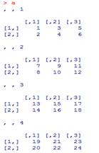
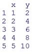
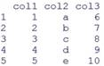

다음에 제시된 문제들을 R 코드로 작성한 후에 lab_03.R 로 저장하여 제출합니다.

[문제1] 다음과 같이 값이 구성되는 배열을 정의하여 a 라는 변수에 저장한다.



 

​    (1) 2행3열4층의 데이터를 출력한다.

​    (2) 각 층마다 2행의 데이터를 출력한다.

​    (3) 각 층마다 1열의 데이터를 출력한다.

​    (4) 3층의 모든 데이터를 출력한다.

​    (5) a라는 배열을 구성하는 모든 데이터에 +100을 연산하여 출력한다.

​    (6) 4층의 모든 데이터들에 100을 곱한 결과를 출력한다.

​    (7) 각층의 1행, 2열과3열만 출력한다.

​    (8) 2층의 2행 데이터들의 값을 100을 더한 값으로 변경한다.

​    (9) 1층의 모든 데이터들의 값에 2를 뺀 값으로 변경한다.

​    (10) a 배열의 모든 데이터 값들을 10을 곱한 값으로 변경한다.

​    (11) a 변수를 삭제한다.

 ```R
#문제1
v<-seq(1:24)
a<-array(v, dim = c(2,3,4))
a[2,3,4]
a[2, , ]
a+100
a[ , ,4]*100
a[1,-1, ]
a[2, ,2] <- a[2, ,2]+100
a[ , ,1] <- a[ , ,1]-2
a <- a*10
rm(a)
 ```


[문제2] 다음과 같이 값이 구성되는 데이터프레임을 정의하여 df1 에 저장한다.



```R
#문제2
x <- seq(1:5)
y <- seq(2,10, by = 2)
df1 <- data.frame(x=x,y=y)
df1r
```


[문제3] 다음과 같이 값이 구성되는 데이터프레임을 정의하여 df2 에 저장한다.

​           

```R
#문제3
col1<-seq(1:5)
col2<-c("a","b","c","d","e")
col3<-seq(6:10)
df2<-data.frame(col1=col1,col2=col2,col3=col3)
df2
```


[문제4] c() 함수로 먼저 벡터를 생성한 다음 data.frame()사용해서 다음과 같이 구성되는 데이터 프레임 df3를 만들어 출력해 본다.(제품명이 팩터형이 되지 않게 한다.)

​      제품명  가격   판매량

​      사과   1800   24

​      딸기   1500   38

​      수박   3000   13

 ```R
#문제4
product<-c("사과","딸기","수박")
price<-c(1800,1500,3000)
sales<-c(24,38,13)
df3<-data.frame(제품명=product,가격=price,판매량=sales,stringsAsFactors=F)
df3
 ```


[문제5] 앞에서 만든 데이터 프레임을 이용해서 과일 가격 평균, 판매량 평균을 구하여 출력한다.

 ```R
#문제5
mean(df3$가격)
mean(df3$판매량)
 ```


[문제6] 다음 세 벡터를 이용하여 데이터프레임 df4를 생성하고, name 변수는 문자, gender 변수는 팩터, math 변수는 숫자 데이터의 유형이라는 것을 확인하시오.

​      name <- c(“Potter”, “Elsa”, “Gates”, “Wendy”, “Ben”)

​      gender <- factor(c(“M”, “F”, “M”, “F”, “M”))

​      math <- c(85, 76, 99, 88, 40)

 위에서 만든 데이터프레임에 대해 다음 작업을 수행하시오. 

(a) stat 변수를 추가하시오. stat <- c(76, 73, 95, 82, 35)

(b) math 변수와 stat 변수의 합을 구하여 score 변수에 저장하시오. 

(c) 논리 연산 인덱싱을 이용하여 score가 150 이상이면 A, 100 이상 150 미만이면 B, 70 이상 100 미만이면 C, 70 미만이면 D  등급을 부여하고 grade 변수에 저장하시오.    

 ```R
#문제6
name <- c("Potter", "Elsa", "Gates", "Wendy", "Ben")
gender <- factor(c("M", "F", "M", "F", "M"))
math <- c(85, 76, 99, 88, 40)
df4<-data.frame(name, gender, math, stringsAsFactors = F)
df4gender = factor(df4$gender)
str(df4)
df4$stat<-c(76,73,95,82,35)
df4$score<-df4$math+df4$stat
df4$grade <- ifelse(df4$score >= 150,"A",ifelse(df4$score >= 100, "B",ifelse(df4$score >= 70, "C", "D")))
 ```


[문제7] emp변수에 할당된 데이터프레임 객체의 구조를 점검한다.

[문제8] emp 에서 3행, 4행 , 5행만 출력한다.

[문제9] emp 에서 ename컬럼만 출력한다.

[문제10] emp 에서 ename 과 sal컬럼만 출력한다.

[문제11] 업무가 SALESMAN 인 사원의 이름, 월급, 직업을 출력한다.

[문제12] 월급이 1000 이상이고 3000이하인 사원들의 이름, 월급, 부서번호를 출력한다.

[문제13] emp 에서 직업이 ANALYST 가 아닌 사원들의 이름, 직업, 월급을 출력한다.

[문제14] emp 에서 업무가 SALESMAN 이거나 ANALYST 인 사원들의 이름, 직업을 출력한다.

[문제15] emp 에서 커미션이 정해지지 않은 직원의 이름과 월급 정보를 출력한다.

​     (NA 값을 채크하는 것은 제공된 교육자료의 1 페이지를 참고한다.)

[문제16] 월급이 적은 순으로 모든 직원 정보를 출력한다.

 ```R
#문제7
emp <- read.csv("data/emp.csv")
str(emp)
#문제8
emp[3:5]
#문제9
emp$ename
#문제10
emp[c("ename","sal")]
#문제11
emp[emp$job=="SALESMAN", c("ename","sal","job")]
#문제12
emp[emp$sal>=1000 & emp$sal<=3000, c("ename","sal","mgr")]
#문제13
emp[!emp$job=="ANALYST", c("ename","job","sal")]
#문제14
emp[emp$job=="SALESMAN" | emp$job=="ANALYST", c("ename","job")]
#문제15
emp[is.na(emp$comm), c("ename","sal")]
#문제16
emp[order(emp$sal,decreasing = F),]
 ```

