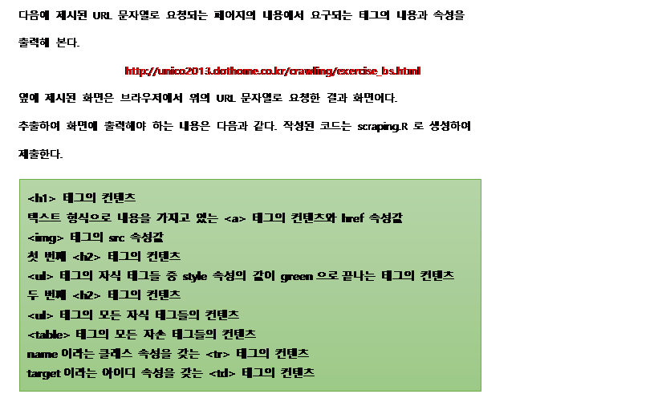
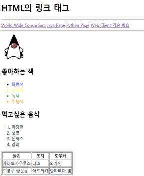

|      |                                     |
| ---- | ----------------------------------- |
|      |  |



```R
url <- "http://unico2013.dothome.co.kr/crawling/exercise_bs.html"
text <- read_html(url)
text
nodes_h1 <- html_nodes(text, "h1")
nodes_h1
html_text(html_nodes(text, "a"))
html_attr(html_nodes(text, "a"), "href")
html_attr(html_nodes(text, "img"), "src")
html_nodes(text, "h2:nth-of-type(1)")
html_text(html_nodes(text, "ul > [style$=green]"))
html_nodes(text, "h2:nth-of-type(2)")
html_text(html_nodes(text, "ol > *"))
html_text(html_nodes(text, "table *"))
html_text(html_nodes(text, "tr[class=name]"))
html_text(html_nodes(text, "tr.name"))
html_text(html_nodes(text, "td#target"))
```

